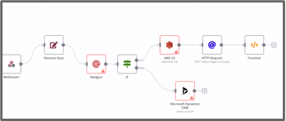
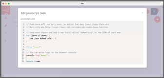
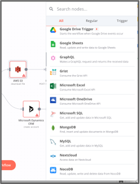
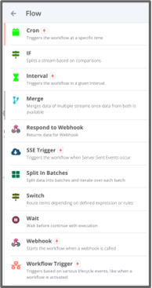
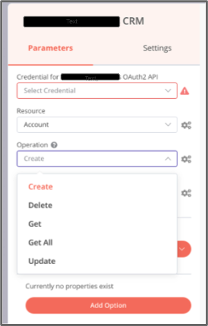
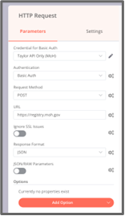
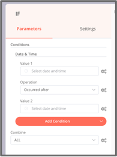

# 10 Other Resources

## User Interfaces Examples

Example user interfaces provide illustrative context for common functionalities.

**Building a process**

**Adding arbitrary scripts to a process**

**Adding new activities to existing processes**

**Adding credentials for use in a process**

**Configuring an HTTP request as an activity in a process**

**Adding a conditional gateway to a process**

These user interface examples are meant to aid reviewers and developers in understanding the high-level requirements of the Workflow Building Block, not to specify certain design elements or guidelines.

1. Link to architecture requirements document (and specific sections within that document, such as cross-functional requirements, and general recommendations).
2. Link to use cases document – this document may be a valuable resource while developing workflows to ensure that a variety of different use cases are covered by the Building Block definition.
3. Link to the Building Block criteria and maturity metrics document created by Tanvir.
4. Link to Low Resource Settings document.
5. Link to GitHub repository and OpenAPI documentation site for the Building Blocks.

### 10.1 Key Decision Log 

[A historical log of key decisions regarding this Building Block](https://govstack-global.atlassian.net/wiki/spaces/GH/pages/183205892). ​

### 10.1 Future Considerations 

[A list of topics that may be relevant to future versions of this Building Block](https://govstack-global.atlassian.net/wiki/spaces/GH/pages/183500904).

## User Journeys and Use Cases

The WFbb is present in multiple use cases. Use cases can be found in the [logical process blueprint](https://docs.google.com/document/d/1DRjpuyINjf6YVBRrEh9Q6VdB0zVzq1aqGQOukpktWZ8/edit#heading=h.f0ewpzm6b55p) and a subset of those that we focus on below can be found [here](https://drive.google.com/drive/folders/1JYdcmeUhJrwl7TfSuVtBJ9a0C335VbRg). These user journeys and use cases have been referenced by the authors of the specification to ensure that the functional requirements for the spec suit the needs of the proposed implementations.

### Postpartum and Infant Care

#### [Promotion for PPIC](https://docs.google.com/document/d/1DRjpuyINjf6YVBRrEh9Q6VdB0zVzq1aqGQOukpktWZ8/edit#heading=h.b4x1x2nfix1p)

| User journey | Use-case  | Capabilities                                                                                      | Functional requirements                                            |
| ------------ | --------- | ------------------------------------------------------------------------------------------------- | ------------------------------------------------------------------ |
| PPIC         | Promotion | CHW uses a Education Materials Database(Content Management System/Registration)                   | GET resource from external system                                  |
| PPIC         | Promotion | CHW selects some materials                                                                        | n/a                                                                |
| PPIC         | Promotion | CHW Chooses a Demographic Group (contact list) from a Demographic Registry(Registration/Registry) | GET resource from external system                                  |
| PPIC         | Promotion | Materials are sent to list of contacts from Demographic Group                                     | Initiate process of sending out mails to uploaded list of contacts |

#### [Payment for PPIC](https://docs.google.com/document/d/1DRjpuyINjf6YVBRrEh9Q6VdB0zVzq1aqGQOukpktWZ8/edit#heading=h.alpzo6mzyzsw)

| User journey | Use-case                                                                                                                                             | Capabilities                                                                                                                                                                                    | Functional requirements                                                                                                      |
| ------------ | ---------------------------------------------------------------------------------------------------------------------------------------------------- | ----------------------------------------------------------------------------------------------------------------------------------------------------------------------------------------------- | ---------------------------------------------------------------------------------------------------------------------------- |
| PPIC         | [Payments - Postpartum and Infant Care](https://docs.google.com/document/d/1DRjpuyINjf6YVBRrEh9Q6VdB0zVzq1aqGQOukpktWZ8/edit#heading=h.alpzo6mzyzsw) | (Voucher Request) Validate the mother has completed all steps (visited a pediatrician, procured medicine and nutrition supplies, and visited the therapy center) by connecting to MCTS registry | Must be able to start a workflow process via API. Support submission of data payload through variables) in the same API call |
| PPIC         | [Payments - Postpartum and Infant Care](https://docs.google.com/document/d/1DRjpuyINjf6YVBRrEh9Q6VdB0zVzq1aqGQOukpktWZ8/edit#heading=h.alpzo6mzyzsw) | (Voucher Request) Verify mother has no pending incentive voucher for this milestone? (from the MCTS registry)                                                                                   | Perform calculation                                                                                                          |
| PPIC         | [Payments - Postpartum and Infant Care](https://docs.google.com/document/d/1DRjpuyINjf6YVBRrEh9Q6VdB0zVzq1aqGQOukpktWZ8/edit#heading=h.alpzo6mzyzsw) | (Voucher Request) Determine payment amounts for HC worker and mother                                                                                                                            | Perform calculation                                                                                                          |
| PPIC         | [Payments - Postpartum and Infant Care](https://docs.google.com/document/d/1DRjpuyINjf6YVBRrEh9Q6VdB0zVzq1aqGQOukpktWZ8/edit#heading=h.alpzo6mzyzsw) | (Voucher Request) Generate cash payment voucher (Voucher number, QR Code, the voucher serial number and its expiry date. At this point the voucher will be flagged Pre-Activated)               | Make HTTP request                                                                                                            |
| PPIC         | [Payments - Postpartum and Infant Care](https://docs.google.com/document/d/1DRjpuyINjf6YVBRrEh9Q6VdB0zVzq1aqGQOukpktWZ8/edit#heading=h.alpzo6mzyzsw) | (Payment Initiation) Submit Payments csv file for approval and budgets (From Ministry of Health to Treasury Deparment)                                                                          | n/a                                                                                                                          |
| PPIC         | [Payments - Postpartum and Infant Care](https://docs.google.com/document/d/1DRjpuyINjf6YVBRrEh9Q6VdB0zVzq1aqGQOukpktWZ8/edit#heading=h.alpzo6mzyzsw) | (Payment Initiation) (Iterate for reach record in CSV file) Verify payment details (ID Drectory Service)                                                                                        | Read from file, loop                                                                                                         |
| PPIC         | [Payments - Postpartum and Infant Care](https://docs.google.com/document/d/1DRjpuyINjf6YVBRrEh9Q6VdB0zVzq1aqGQOukpktWZ8/edit#heading=h.alpzo6mzyzsw) | (Payment Initiation) Process Payments csv approval / rejected by Treasury                                                                                                                       | Perform caculation                                                                                                           |
| PPIC         | [Payments - Postpartum and Infant Care](https://docs.google.com/document/d/1DRjpuyINjf6YVBRrEh9Q6VdB0zVzq1aqGQOukpktWZ8/edit#heading=h.alpzo6mzyzsw) | (Payment Disbursement) Submit Payment Instruction (from Disbursement Organization - Payer) to Payment Gateway (Payments Building Block supported by Workflow Building Block in the back-end)    | Make HTTP request                                                                                                            |
| PPIC         | [Payments - Postpartum and Infant Care](https://docs.google.com/document/d/1DRjpuyINjf6YVBRrEh9Q6VdB0zVzq1aqGQOukpktWZ8/edit#heading=h.alpzo6mzyzsw) | (Payment Disbursement) Payment Gateway query to ID Directory Service (requesting Mobile Money provider details for mother)                                                                      | n/a                                                                                                                          |

#### [Case Management for PPIC](https://docs.google.com/document/d/1DRjpuyINjf6YVBRrEh9Q6VdB0zVzq1aqGQOukpktWZ8/edit#heading=h.rtd5sp81sw9b)

| User journey | Use-case        | Capabilities                                                     | Functional requirements                                                                                                                                                                                                                |
| ------------ | --------------- | ---------------------------------------------------------------- | -------------------------------------------------------------------------------------------------------------------------------------------------------------------------------------------------------------------------------------- |
| PPIC         | Case Management | 1. Validate client identifier (biometrics)                       | If validation requires checking with multiple other applications, this might require workflow. (Must be able to start a workflow process via API. Support submission of data payload through variables) in the same API call)          |
| PPIC         | Case Management | 3. Submit new client encounter details to case management system | If a multi-step process is required for submitting encounter details this might be handled by workflow. (Must be able to start a workflow process via API. Support submission of data payload through variables) in the same API call) |

### Unconditional Social Cash Transfer

#### [Eligibility for USCT](https://docs.google.com/document/d/1pBr0wHt9W4boeEzCWA21TIzhetPPlA4ad3PrQHWwNcU/edit#heading=h.9l9ar3fqqo6u)

| User journey | Use-case                                                                                                                                        | Capabilities                                                                      | Functional requirements                                                                                                                                                    |
| ------------ | ----------------------------------------------------------------------------------------------------------------------------------------------- | --------------------------------------------------------------------------------- | -------------------------------------------------------------------------------------------------------------------------------------------------------------------------- |
| USCT         | [001: Eligibility Determination and Benefit Package(s) Design](https://docs.google.com/document/d/1pBr0wHt9W4boeEzCWA21TIzhetPPlA4ad3PrQHWwNcU) | Send beneficiary data from Registration Building Block to Workflow Building Block | Must be able to start a workflow process via API. Support submission of data payload through variables) in the same API call                                               |
| USCT         | [001: Eligibility Determination and Benefit Package(s) Design](https://docs.google.com/document/d/1pBr0wHt9W4boeEzCWA21TIzhetPPlA4ad3PrQHWwNcU) | Check if the beneficiary is above the age of 18 from National ID Registry         | Must be able to perform an external task or similar which calls remote service (REST API). Response from Remote service should contain requested data and/or response code |
| USCT         | [001: Eligibility Determination and Benefit Package(s) Design](https://docs.google.com/document/d/1pBr0wHt9W4boeEzCWA21TIzhetPPlA4ad3PrQHWwNcU) | Check if the beneficiary is employed from Employment Registry                     | Must be able to perform an external task or similar which calls remote service (REST API). Response from Remote service should contain requested data and/or response code |
| USCT         | [001: Eligibility Determination and Benefit Package(s) Design](https://docs.google.com/document/d/1pBr0wHt9W4boeEzCWA21TIzhetPPlA4ad3PrQHWwNcU) | Check if the beneficiary is receiving any income from Taxk Registry               | Must be able to perform an external task or similar which calls remote service (REST API). Response from Remote service should contain requested data and/or response code |

#### [Payment (type 1) for USCT](https://docs.google.com/document/d/1uP\_v9BYDg8P7B7anRA1e-F3XLFb9MFMYbllfbYZGAhI/edit#heading=h.9l9ar3fqqo6u)

| User journey | Use-case                                                                                                                                                    | Capabilities                                                                                                            | Functional requirements       |
| ------------ | ----------------------------------------------------------------------------------------------------------------------------------------------------------- | ----------------------------------------------------------------------------------------------------------------------- | ----------------------------- |
| USCT         | [001: Payment (non-electronic/cash payments)](https://docs.google.com/document/d/1uP\_v9BYDg8P7B7anRA1e-F3XLFb9MFMYbllfbYZGAhI/edit#heading=h.9l9ar3fqqo6u) | Receive trigger from Scheduling Building Block that due date has been reached                                           | Initiate worfklow via webhook |
| USCT         | [001: Payment (non-electronic/cash payments)](https://docs.google.com/document/d/1uP\_v9BYDg8P7B7anRA1e-F3XLFb9MFMYbllfbYZGAhI/edit#heading=h.9l9ar3fqqo6u) | Load SRIS (Social Registry Information System) workload (i.e a list of eligible beneficiaries that are due for payment) | Make HTTP GET request         |
| USCT         | [001: Payment (non-electronic/cash payments)](https://docs.google.com/document/d/1uP\_v9BYDg8P7B7anRA1e-F3XLFb9MFMYbllfbYZGAhI/edit#heading=h.9l9ar3fqqo6u) | Iterate through each beneficiary and compute payment amounts due to beneficiary                                         | Perform calculation, loop     |
| USCT         | [001: Payment (non-electronic/cash payments)](https://docs.google.com/document/d/1uP\_v9BYDg8P7B7anRA1e-F3XLFb9MFMYbllfbYZGAhI/edit#heading=h.9l9ar3fqqo6u) | Request payment for beneficiary (Payment Building Block)                                                                | Make HTTP POST request        |
| USCT         | [001: Payment (non-electronic/cash payments)](https://docs.google.com/document/d/1uP\_v9BYDg8P7B7anRA1e-F3XLFb9MFMYbllfbYZGAhI/edit#heading=h.9l9ar3fqqo6u) | Set TransactionID for successful payment and mark beneficiary as paid (Social Registry)                                 | Make HTTP POST request        |

#### [Payment (type 2) for USCT](https://docs.google.com/document/d/1Eu52kE2TC1qZ5ps5-fWBGD570G-gB7mt-JYuIrTroLQ/edit#heading=h.9l9ar3fqqo6u)

| User journey | Use-case                                    | Capabilities                                                                                                             | Functional requirements                                            |
| ------------ | ------------------------------------------- | ------------------------------------------------------------------------------------------------------------------------ | ------------------------------------------------------------------ |
| USCT         | 002: Payment (non-electronic/cash payments) | Receive trigger from Scheduling Building Block that due date has been reached                                            | Allow the initiation of an async business process via POST to API. |
| USCT         | 002: Payment (non-electronic/cash payments) | Load SRIS (Social Registry Information System) workload (i.e. a list of eligible beneficiaries that are due for payment) | Make HTTP GET request                                              |
| USCT         | 002: Payment (non-electronic/cash payments) | Request beneficiary payment details (from Social Registry)                                                               | Make HTTP GET request                                              |
| USCT         | 002: Payment (non-electronic/cash payments) | Compute payment amount for beneficiary                                                                                   | Perform calculation                                                |
| USCT         | 002: Payment (non-electronic/cash payments) | Generate TransactionID for payment due                                                                                   | Generate rand (execute script)                                     |
| USCT         | 002: Payment (non-electronic/cash payments) | Request payment voucher (Payment Building Block)                                                                         | Make HTTP request                                                  |
| USCT         | 002: Payment (non-electronic/cash payments) | Make voucher as paid (Payment Building Block)                                                                            | Make HTTP request                                                  |
| USCT         | 002: Payment (non-electronic/cash payments) | Mark beneficiary as paid (Social Registry)                                                                               | Make HTTP request                                                  |
