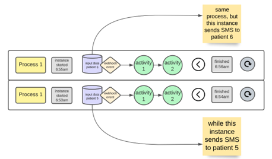
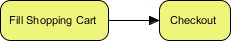
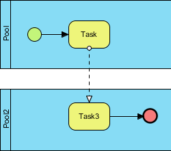
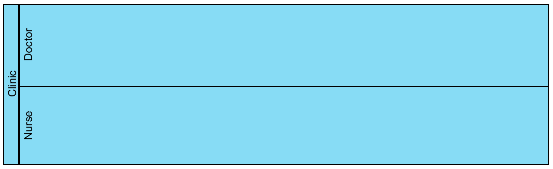

# 3 Terminology

## Overview

The Workflow Building Block is generic, flexible, and un-opinionated. These aspects are crucial, as they enable many different kinds of automated processes to be designed and executed. Fundamentally, every activity in a process may itself be another process—which includes multiple activities, and so on ad infinitum.

Bearing this in mind, it is still useful to have shorthand terminology to refer to a collection of activities, or a single activity relative to some linguistic scope that’s being applied in conversation.

To achieve infinite “nestability” and enable conversational coherence for human beings, we have settled on two terms to refer to:

* activity: a step, relative to some multi-step workflow.
* process: a multi-step workflow itself, or a collection of steps.

## Process

A business process is defined as a set of one or more linked activities that collectively realize a business objective. A single process may have branching logic based around “gateways” which automate decisions. Alternatively, whichever actor initiates a process may decide to initiate different (related) processes depending on different conditions or inputs.

### Asynchronous Process

An asynchronous process is the default process type for the Workflow Building Block, and once instantiated will return a 202/Accepted but then continue to execute the instance. Note that many asynchronous processes may include requests back to the initially requesting application, but these are new requests, not responses to the initial request.

### Synchronous Process

A synchronous process is a process that, once instantiated, will complete before returning a response to the request. The process instance is blocking and should be used sparingly.

### Example Processes

#### Ex. Process “A”

1. Activity 1: jump in water
2. Activity 2: swim 1 mile east
3. Activity 3: get out of water
4. Activity 4: add 3 + 2
5. Activity 5:
   1. if (state.hasElectronicRegistration)
   2. then: execute “Process C”
   3. else: execute “Process D”

#### Ex. Process “Registration”

1. Activity 1: turn off light
2. Activity 2: execute “Process A”
3. Activity 3: multiply 7 \* 5
4. Activity 4: Run arbitrary NodeJs script “myScript.js” with input X
5. Activity 5: make HTTP post request to server Y

## Activity

An “activity” is an atomic task or step in a process. An activity is created when the task cannot be broken down to a finer level of detail. Generally, an application (or person) will perform the activity when executed. There may be many different types of activities.

For example, note that an activity may be another “Process” in its entirety (N.B., in Camunda this is an “activity”, in OpenFn this is an “operation”, elsewhere it is a “step” in a process).

### Activity Types

#### User-driven

A “user-driven activity” is an activity that represents the completion of some unit of offline work, done by a human being. If a user-driven activity is used in a process, the \_next \_activity in the process will not be initiated until the activity is marked as completed, potentially with some output data captured to be used in subsequent activities.

#### Service-driven

A “service-driven activity” is an activity that is completed by a machine.

### Example Activities

#### Ex. User-Driven Activity 1:

```
Perform consultation
```

#### Ex. Service-driven Activity 2:

```
Add 3 + 2; return result
```

## Instance

An instance, or “process instance” is the unique thread of execution of a process. It has input data, a start time, an end time, a log, an exit code, and other attributes. There may be N number of instances for a given process.

Consider a “Register Newborn Child” process and consider that 50 babies are born today. We may see 50 instances of this 1 “Register Newborn Child” process (some instances may still be running, some may have been completed, some may have failed).

#### Ex. Instance “061816db-221b-7ddf-a69c-d2b3e53f6094”

```
Process: “Process A”


Trigger: Webhook Event


Start: 07:37:00 00:13:12.3132


End: 08:15:25 13:24:12.3222


Exit Code: **1** (failure)


Log: “HTTP REQUEST ERROR 502”
```

#### Ex. Instance “061816d9-f59c-7ae5-a2e5-a2a2b4b3bc0e”

Process: “Registration Process”

```
Trigger: Webhook Event

Start: 11:57:00 01:28:12.1328


End: 14:22:25 05:24:12.8932

Exit Code: **0** (success)

Log: “New Patient Added!”
```

## Gateway

Decision gateways are flow-control elements, which are used to control how activities interact as they converge and diverge within a process. Entered (or “triggered”) by activities, a gateway acts as a function that decides which (outgoing) path to follow based on the result of the evaluation of the given set of conditions. A gateway enables the implementation of branching, forking, merging, and joining of paths in a business process diagram.

There are different types of Gateways. The most used is the “exclusive gateway”, which is used for creating alternative paths within a process flow. For example, exclusive decisions, or sequence flow looping.

Another type is the “inclusive gateway” where all condition expressions are evaluated. Since each alternative path is independent, any combination of the outgoing paths may be taken.

The Gateways do not represent work that is done and they are not expected to have any effect on the operational measures of the process to be executed (costs, time, etc.).

### Exclusive Gateway

An exclusive gateway is a point of diversion for a business process flow. For a given instance of the process, only one of the paths can be taken. An exclusive gateway may be used to achieve “looping” or “iteration” because if a condition is not met, the “next step” in the process may be another part of the process that provides a “way back” to the gateway in question after other activities are completed.

### Inclusive Gateway

Unlike the exclusive gateway, an inclusive gateway may trigger the execution of more than one out-going flow. Since an inclusive gateway may trigger more than one out-going flow, the condition-checking process is a bit different from the exclusive gateway. Under an inclusive gateway, all the out-going conditions will be evaluated.

### Event-based gateway

The Event-Based Gateway represents a branching point in the Process where the alternative paths that follow the Gateway are based on Events that occur, rather than the evaluation of Expressions using Process data (as with an Exclusive or Inclusive Gateway).

A specific Event, usually the receipt of a Message, determines the path that will be taken. Basically, the decision is made by another Participant, based on data that is not visible to Process, thus, requiring the use of the Event-Based Gateway.

### Parallel Gateway

A parallel gateway is used to visualize the concurrent execution of activities and is used in pairs. When the process arrives at the “parallel gateway node”, all the outgoing flows exhibited from the gateway will be executed simultaneously. The flow will be merged at the “joining parallel gateway”.

## State

State is a JSON object which contains the required data (or input values) for a process to begin execution. When a process is instantiated (we create a new “instance”) in many cases, the initial “state” will be provided to the instance. State should be a JSON object, and activities in the process should be able to make use of this initial state—i.e., to work with “variables” that may change across each instance for the process.

Consider a process that contains an activity to “send an SMS to a patient”. The process definition may dictate “send SMS to state.patient.ssid” and when the process is instantiated with the initial state from patient A’s clinical visit, the recipient of that SMS will be different from when the same process is instantiated with the initial state from patient B’s clinic visit (i.e., one process with two instances and SMSs sent to two different people).

Below, the same process (Process 1) sends an SMS to two different people depending on the initial state it receives from in the triggering webhook event.



**E.g.: Start the beneficiary scoring for beneficiary X:**

Make POST to /API/workflow/beneficiary-scoring-process with the following body:

```
{
  "callbackUrl": 'https://www.moh.gov/api/liveScoring',
  "beneficiaryDetails": { "age": 20, "name": "Bukayo Saka" },
  "arbitraryThing": "that's fine",
  "id": 326178
}
```

The process should be built with knowledge (in so far as it’s needed) of the initial state that will be provided when it is called/a new instance is created.

The final activity in this process might be:

MAKE A POST to \`${state.callbackUrl}/${state.id} with BODY { “score”: state.finalScore }

## Event

An event is something that “happens” during the course of a process. Events affect the flow of the process and usually have a cause or an impact and in general require or allow for a reaction. The term “event” is generally enough to cover many things in a process. The start of an activity, the end of an activity, the change of state of a document, a Message that arrives, etc., all could be considered Events.

Types:

* Start event.
* Intermediate events.
* End event.

## Business Process Model & Notation (BPMN)

At multiple points in this document we refer to BPMN and many elements of the terminology section are terms borrowed directly from BPMN. See a list of all standards we use in the “Standards” section, and view the [BPMN 2.022.0 spec](https://www.omg.org/spec/BPMN/).

## Other terms to define

These terms may be defined in later versions of the specification. Proposals are welcome.

### Sequence flow

A sequence flow is used to connect flow objects in a process or choreography to show the flow. A sequence flow is used to connect flow elements. It is shown in a solid line with an arrowhead. It shows the order of flow elements.

###



###

### Message flow

Message flow is used to show the flow of messages between separate pools/lanes. You cannot use message flow to connect flow objects within the same participant.



### Process model

A process model, often depicted using Business Process Mapping Notation (BPMN) is a design output that depicts the steps of a business process from end to end.

### Token

A token is an abstract concept in BPMN. A token, formally referred to as a process token, refers to the current activity being executed within a process instance. A business process can have multiple tokens that indicate that the process is running in multiple paths. For example, gateways are often used to split the path of a process. Splitting a process path creates multiple process tokens.

Note that a single token will have at least three attributes: id, processInstanceId, and activityId. If a gateway is used to “split” a process, there may exist multiple tokens per process instance.

### Pool

A pool in Business Process Model & Notation (BPMN) represents a participant in business collaboration. In a BPMN model (or diagram) a pool can represent an entity like a company, a role (e.g a buyer, seller, or customer), or even a system (e.g., OpenMRS API).

###

### Lane

A BPMN Lane is a sub-partition within a Pool (see above) which extends the entire length of the Pool, either horizontally or vertically. Lanes are used to organize and categorize Activities within a Pool. In practice, lanes are commonly used for allocating activities to roles, systems, or the organization’s departments.


