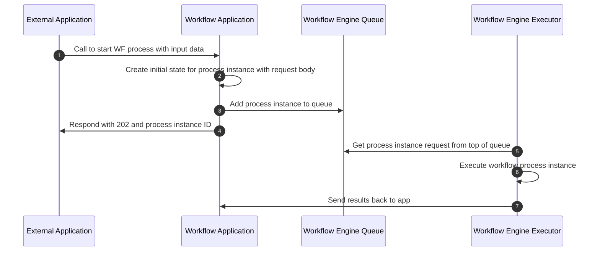

# 9 Internal Workflows

There are no required internal workflows for candidate applications that implement the Workflow Building Block specification. Below is an example of how an internal workflow might run when responding to an API request.

## 9.1 Start a workflow process via API

To satisfy functional requirements 10, 11, and 12, a candidate application may implement the following internal workflow.

