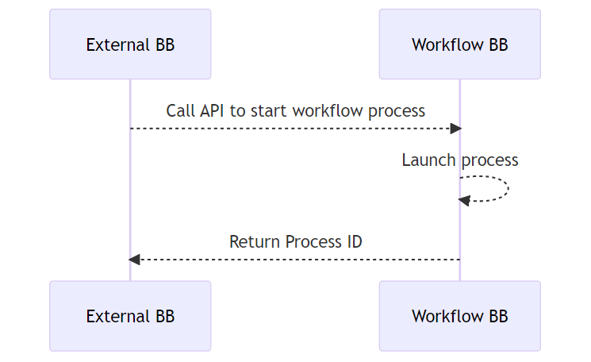

# 9 Workflows

## 9.1 Start a workflow process via API

This internal workflow is used by the Workflow Building Block to initiate a
workflow process. An external application (Building Block) calls an API in the
Workflow Building Block which will launch a workflow process. This functional
requirement must also support submission of data payload through variables in
the same API call. Examples:

- [PostPartum and Infant Care Use Case](https://govstack-global.atlassian.net/wiki/spaces/GH/pages/49381394/PostPartum-01-Example+Implementation+Original+-+multiple+steps),
  Payment Step: Validate the mother has completed all steps (visited a
  pediatrician, procured medicine and nutrition supplies, and visited the
  therapy center) by connecting to MCTS registry
- [Unconditional Social Cash Transfer, Eligibility Determination](https://govstack.gitbook.io/product-use-cases/product-use-case/inst-1-unconditional-social-cash-transfer):
  Send beneficiary data from Registration BB to Workflow BB]

