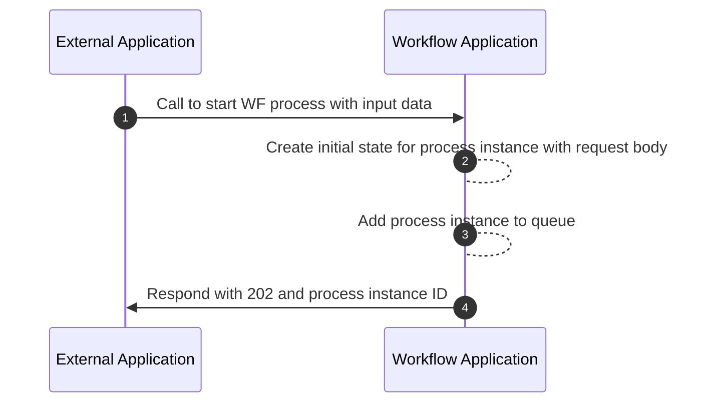

# 9 Internal Workflows

There are no _required_ internal workflows for candidate applications that
implement the workflow BB specification. Below is an example of how an internal
workflow might run when responding to an API request.

## 9.1 Start a workflow process via API

To satisfy functional requirements 10, 11, and 12, a candidate application may
implement the following internal workflow.

